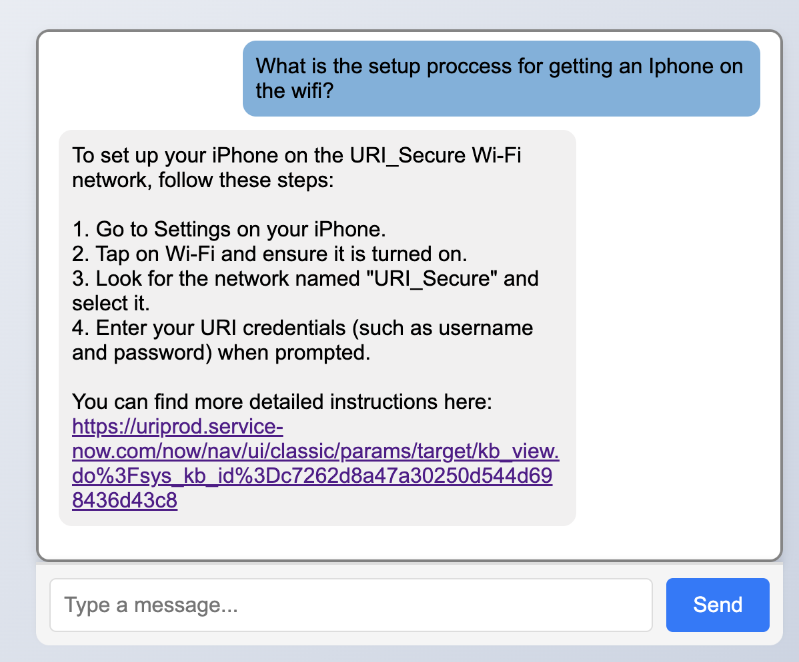

# IT Chat Bot Project

## A Python and React Project that Allows Users to Search IT Documents Through a Conversational Interface

Example Use Case:

## Key Features

### 1. Search Capability:

The search engine uses a TF_IDF algorithm to rank documents based on their similarity and importance to the user's search. The approach I took has multiple advantages:

* The underlying data structure of an Inverted Index allows for rapid retrieval of information with parameters to decide the number of documents returned.
* Name Object Recognition to give more importance to product names such as "Google" on internal documents.
* TF_IDF files can be changed on the fly allowing for different areas of search to be alternated quickly.

### 2. OpenAI API Integration:

Open AI's API is used throughout the project to not just improve the user experience but also to improve the accuracy of search results.

##### KeyWord Extraction
The API is called to extract keywords from the user query. This improve search results but also blocks the user from attempting any form of prompt injection.

##### AI Enhanced Querying

Search results are filtered through the AI which then finds the most relevant answer, given the original query, and adapts that into a formatted message for the User. 

Example: Brightspace is the learning tool used at the University and appears in many documents so a general question about its usage might not return the most accurate result first.

##### Ex. User Query: "What is Brightspace?"

Terminal output showing the top results given the query and keywords:

As you can see the answer is found partially in both Question 1 and Question 5. AI is able to analyze this to return a much more accurate answer.

##### Final AI Output

It has taken the top 10 results an combined them into one answer that best fits the users original query! 

### 3. Interactive UI using React:

User results are presented in a Visual that will be familiar to other chat bots they have likely used.

It is able to be used on many different device types and screen resolutions

Computer (left) and phone (right)

It also has features that make it more intuitive to use.
* Chat bubbles that allow the user to read previous messages and conversation 
* Dedicated Send Button for mobile users 
* Loading icons to indicate that an answer is being decided on

### 4. Document Security and Scalability 

One of the main motivators for creating this Project as apposed to using a created project such as a Custom GPT from OpenAI is the security of the documents being searched. 

By separating the Internal Documents, Knowledge Base Articles, and Addition Knowledge from being directly uploading into a website and instead feeding out snippets of the search to OpenAI, the security of the documents is improved. 

In addition to this, the algorithm used to covert internal website documents into JSON files allows for the search base to be expanded as documents are updated or added. This update can be done in a single call of the Updater file.

### 5. Real Life Usage

This project has already become integrated to within my own Day to Day operations at my school IT Service Desk. Multiple of my fellow coworkers have also been using it when provided through the local network hosting. 

One prominent use case is for Teaching and Learning which is a department that handles Brightspace integration for teachers. They operate for only 2 hours a day but users still come in and ask questions that we are not trained for outside those hours. This tool has be invaluable for those users.

## Setup and Usage

#### 1. Download Usage Documents into either .HTML or .DOCX format

These formats allow for google docs and internal websites to both be added. I placed my documents within separated folders for different types but this is not needed.

#### 2. Run the Updater File located in File_Management

This file allows for whole directories to be turned into a text file, then into a JSON File. You can separate these steps by instead running the imported clean_and_format_file and write_json in order to manually go through the cleaned file to check for errors. 

#### 3. Create the TF_IDF File

This can be done by uncommenting the commented lines within the Inverted_Index file. The make_tf_idf will create a dedicated file that can be called later on to save run time.

#### 4. Start the Flask Backend

Flask is used within this Project to interface with the React Frontend. Start it by running the Server file. It should display this message:

It will also give output when requests are made. Additions to the server file can be made to print out user query, keywords, or output to assist with debugging.

#### 5. Start the React Frontend 

After ensuring that Node.js is installed on your computer CD into the react folder and run "npm start". The React front end should then open up. 

#### 6. Begin asking questions

Questions can be formatted in a conversation manner and types will not cause issues. 

## Conclusion

#### Skills learned throughout the Project

* Using and Debugging and AI API 
* Creating and optimizing a search engine
* Create a interactive front end using React
* Integrating a backend and frontend to provide data

#### Future Planned Additions 

* Updates to the React frontend to allow user control over parameters such as TLS or ITS mode
* Addition of Online Articles for more general troubleshooting 
* Hosting the website online through a website hosting service 
* Changes to the file updater to make it support more file types such as .pdf

###### Created by Zachary Lerner 8/17/24

 

